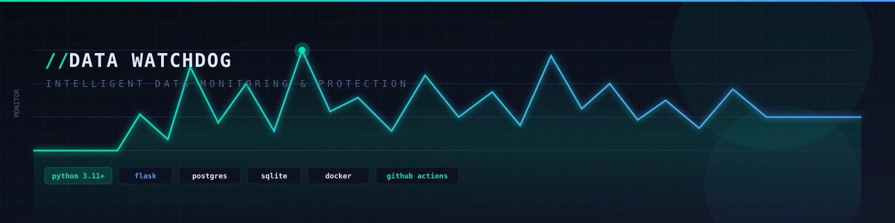

<div align="center">

# Data Watchdog

### Intelligent Data Monitoring & Protection

<p>
  
</p>

<p>
  <strong>A lightweight data observability platform for detecting data quality anomalies before they become downstream incidents.</strong>
</p>

<p>
  <a href="https://github.com/Maiii66/data-watchdog"></a>
  <a href="https://github.com/Maiii66/data-watchdog/actions"></a>
  
  
  
</p>

</div>

## Overview

Data Watchdog is a configurable data observability tool designed to monitor datasets, maintain historical snapshots, detect common data-quality failures, expose health information through a web dashboard, and notify operators when anomalies are detected.

It is built around a simple production-oriented idea:

> **Detect data problems at the source — before they propagate into dashboards, reports, models, or business decisions.**

The current implementation supports CSV and PostgreSQL sources, four core quality checks, SQLite-based metadata/history storage, a Flask dashboard/API, scheduled monitoring, Slack/email notifications, Docker support, and automated CI testing.

---

## Why Data Watchdog?

Data failures are often silent:

- A pipeline suddenly loads 400 rows instead of 20,000.
- A critical column disappears after a schema change.
- A field that normally has very few missing values develops a large null spike.
- A source stops updating and downstream consumers continue using stale information.

Traditional application monitoring can report that a pipeline *ran successfully*. Data observability asks a more important question:

> **Did the pipeline produce trustworthy data?**

Data Watchdog focuses on that question.

---

## Key Capabilities

| Capability | What it does |
|---|---|
| **Volume anomaly detection** | Compares current row counts with historical behavior using a configurable z-score threshold. |
| **Schema change detection** | Detects added and removed columns between snapshots. |
| **Null spike detection** | Flags columns whose missing-value rate crosses the configured threshold. |
| **Freshness monitoring** | Detects sources that have not been updated within the configured time window. |
| **Snapshot history** | Stores source health metadata in SQLite for historical analysis. |
| **Lineage awareness** | Associates sources with downstream dashboards, reports, and systems that may be affected. |
| **Live dashboard** | Provides source health, alerts, row-count trends, null-rate information, and lineage context. |
| **Scheduled monitoring** | Runs checks automatically using APScheduler at a configurable interval. |
| **Slack + email notifications** | Sends anomaly notifications through configurable channels. |
| **Alert deduplication** | Prevents repeated notifications when the same alert set persists. |
| **Docker support** | Includes production image and PostgreSQL test infrastructure. |
| **CI pipeline** | Runs dependency installation, linting, PostgreSQL-backed tests, coverage, and Docker builds. |

---

## Architecture

```
                         ┌─────────────────────────┐
                         │       config.yaml       │
                         │ Sources • Checks •      │
                         │ Schedule • Notifications│
                         └────────────┬────────────┘
                                      │
                                      ▼
┌────────────────┐          ┌──────────────────────┐
│   CSV Source   │─────────▶│                      │
└────────────────┘          │     Source Layer     │
                            │  CSV / PostgreSQL    │
┌────────────────┐          │                      │
│ PostgreSQL     │─────────▶│                      │
└────────────────┘          └──────────┬───────────┘
                                       │
                                       ▼
                            ┌──────────────────────┐
                            │      Snapshot        │
                            │ row count • schema • │
                            │ null counts • time   │
                            └──────────┬───────────┘
                                       │
                                       ▼
                            ┌──────────────────────┐
                            │    Check Registry    │
                            ├──────────────────────┤
                            │ Volume Anomaly       │
                            │ Schema Change        │
                            │ Null Spike            │
                            │ Freshness             │
                            └──────────┬───────────┘
                                       │
                        ┌──────────────┴──────────────┐
                        ▼                             ▼
              ┌─────────────────┐           ┌─────────────────┐
              │ SQLite History  │           │ Alert / Notify  │
              │   meta.db       │           │ Slack + Email   │
              └────────┬────────┘           └─────────────────┘
                       │
                       ▼
              ┌─────────────────┐
              │ Flask API       │
              │ /api/status     │
              │ /api/source/... │
              │ /api/run-monitor│
              └────────┬────────┘
                       │
                       ▼
              ┌─────────────────┐
              │ Web Dashboard   │
              │ Health • Trends │
              │ Alerts • Lineage│
              └─────────────────┘
```

---

## Monitoring Model

Every monitoring run follows the same pipeline:

```
Load source
    ↓
Create snapshot
    ↓
Load historical snapshots
    ↓
Run configured quality checks
    ↓
Persist current snapshot
    ↓
Print alerts / identify affected lineage
    ↓
Notify if required
    ↓
Expose current state through dashboard/API
```

A snapshot currently captures:

- **Timestamp**
- **Row count**
- **Column names**
- **Null counts by column**

This deliberately keeps the metadata layer lightweight while providing enough information for the implemented checks.

---

## Quality Checks

### 1. Volume Anomaly

Uses historical row counts to calculate a z-score:

```
z = (current_row_count - historical_mean) / historical_std
```

An alert is raised when the absolute z-score exceeds the configured threshold. A minimum history length prevents the check from making decisions from too little historical data.

**Default configuration:**

```yaml
volume_anomaly:
  enabled: true
  z_threshold: 2.0
  min_history: 5
```

### 2. Schema Change

Compares the latest schema against the previous snapshot and reports:

- Removed columns → **error**
- Added columns → **warning**

```yaml
schema_change:
  enabled: true
```

### 3. Null Spike

Calculates missing-value rates from the current snapshot and raises an alert when a configured percentage is exceeded.

**Default threshold:**

```yaml
null_spike:
  enabled: true
  threshold_pct: 20.0
```

### 4. Freshness

Checks whether the monitored data has become stale relative to the configured maximum age.

**Default configuration:**

```yaml
freshness:
  enabled: true
  max_hours: 2
```

---

## Technology Stack

### Backend

| | |
|---|---|
| **Python** | 3.11+ |
| **Flask** | dashboard/API backend |
| **Pandas** | dataframe-based source processing |
| **NumPy** | statistical calculations |
| **SQLAlchemy** | PostgreSQL table access |
| **psycopg2** | PostgreSQL connectivity |
| **APScheduler** | background scheduling |

### Storage

| | |
|---|---|
| **SQLite** | monitoring metadata and snapshot history |
| **PostgreSQL** | supported monitored data source |
| **CSV** | supported local data source |

### Operations

| | |
|---|---|
| **Docker / Docker Compose** | containerized workflows |
| **GitHub Actions** | automated CI |
| **pytest + coverage** | test suite |
| **flake8** | linting |
| **Slack Webhooks** | notifications |
| **SMTP email** | notifications |

### Frontend

HTML/CSS/JavaScript dashboard served by Flask.

---

## Project Structure

```
data-watchdog/
│
├── app.py                    # Flask application, API and scheduler
├── monitor.py                # Core monitoring pipeline
├── sources.py                # CSV/PostgreSQL source adapters
├── config_loader.py          # YAML + environment configuration loader
├── config.yaml               # Main application configuration
├── alerts.py                 # Console alert formatting
├── notify.py                 # Slack/email notifications + deduplication
│
├── checks/
│   ├── __init__.py
│   ├── base.py               # Base check abstraction
│   ├── registry.py           # Check registration/config loading
│   ├── volume.py             # Row-count anomaly detection
│   ├── schema.py             # Schema change detection
│   ├── nulls.py              # Null-rate monitoring
│   └── freshness.py          # Data freshness monitoring
│
├── static/
│   └── dashboard.html        # Monitoring dashboard
│
├── scripts/
│   └── init.sql              # PostgreSQL sample/test schema
│
├── data/
│   └── .gitignore            # Local/generated datasets
│
├── tests/
│   └── test_basic.py         # Unit + integration tests
│
├── docs/
│   └── assets/
│       └── data-watchdog-banner.svg
│
├── Dockerfile.prod           # Production container image
├── docker-compose.yml        # Local PostgreSQL environment
├── docker-compose.test.yml   # PostgreSQL + application test stack
├── requirements.txt          # Runtime dependencies
├── requirements-dev.txt      # Development/test dependencies
├── .env.example              # Environment variable template
└── .github/workflows/
    └── ci-cd.yml             # GitHub Actions pipeline
```

---

## Getting Started

### Prerequisites

Recommended local setup:

- Python 3.11+
- Git
- Optional: Docker Desktop for PostgreSQL/container workflows

### 1. Clone the repository

```bash
git clone https://github.com/Maiii66/data-watchdog.git
cd data-watchdog
```

### 2. Create a virtual environment

**Windows PowerShell**

```powershell
python -m venv venv
.\venv\Scripts\Activate.ps1
```

**Windows CMD**

```bat
python -m venv venv
venv\Scripts\activate
```

**Linux / macOS**

```bash
python3 -m venv venv
source venv/bin/activate
```

### 3. Install dependencies

```bash
pip install -r requirements.txt
```

For development/testing:

```bash
pip install -r requirements-dev.txt
```

### 4. Configure environment variables

```bash
copy .env.example .env
```

For Linux/macOS:

```bash
cp .env.example .env
```

Update `.env` with the PostgreSQL and notification settings you intend to use.

> **Security:** never commit `.env`, webhook URLs, SMTP passwords, or other credentials. The repository is configured to ignore `.env`.

---

## Configuration

The primary configuration file is `config.yaml`. It centralizes sources, storage, checks, scheduling, and notifications so thresholds can be changed without modifying application code.

**Example:**

```yaml
data_sources:
  - name: orders_csv
    type: csv
    file: data/orders.csv
    lineage:
      - Local Backup Check

storage:
  database: meta.db
  history_limit: 30

checks:
  volume_anomaly:
    enabled: true
    z_threshold: 2.0
    min_history: 5

  schema_change:
    enabled: true

  null_spike:
    enabled: true
    threshold_pct: 20.0

  freshness:
    enabled: true
    max_hours: 2

schedule:
  enabled: true
  interval: 30m
```

Environment variables can be referenced from YAML using the `${VARIABLE_NAME}` format.

---

## Running the Monitor

### Generate sample data

```bash
python generate_data.py
```

### Run a monitoring cycle

```bash
python monitor.py
```

The monitor loads every configured source, creates a snapshot, runs the enabled checks, persists history, and sends notifications when anomalies are detected.

### Run the dashboard

```bash
python app.py
```

Open:

```
http://localhost:5000
```

The Flask application also exposes monitoring APIs.

### API endpoints

| Method | Endpoint | Purpose |
|---|---|---|
| GET | `/api/status` | Returns overall health, alert count, and source status. |
| GET | `/api/source/<source_name>` | Returns detailed health information for one source. |
| POST | `/api/run-monitor` | Manually triggers a monitoring cycle. |

---

## Simulating Data Failures

The repository includes a sample-data workflow for demonstrating detection behavior.

To simulate a broken dataset, enable the `break_it=True` path in `generate_data.py` and then run:

```bash
python generate_data.py
python monitor.py
```

This can be used to demonstrate conditions such as:

- Reduced row volume
- Missing columns
- Increased null values

The resulting alerts are visible in the console and, when configured, through Slack/email notifications and the dashboard.

---

## Notifications

Data Watchdog supports:

### Slack

Configure the Slack Incoming Webhook URL through the environment:

```
SLACK_WEBHOOK_URL=...
```

Enable the channel in `config.yaml`:

```yaml
notifications:
  slack:
    enabled: true
    webhook_url: ${SLACK_WEBHOOK_URL}
```

### Email

Configure SMTP credentials in `.env`:

```
SMTP_HOST=smtp.gmail.com
SMTP_PORT=587
SMTP_USER=...
SMTP_PASS=...
SMTP_FROM=...
ALERT_EMAIL=...
```

The notification layer also performs **alert-set deduplication**, so an unchanged persistent failure does not repeatedly send the same notification on every scheduled run.

---

## Scheduling

The application uses APScheduler for in-process scheduled monitoring.

**Example:**

```yaml
schedule:
  enabled: true
  interval: 30m
```

The scheduler is started when `app.py` starts. Monitoring executions are protected by a lock and the scheduler is configured with a single active monitor instance to avoid overlapping runs.

For production deployments, external orchestration such as a process manager, cron, Task Scheduler, or container orchestrator can be considered depending on the deployment model.

---

## Docker

### Start PostgreSQL locally

```bash
docker compose up -d
```

The included Compose configuration starts PostgreSQL 16 and initializes the database using `scripts/init.sql`.

### Build the application image

```bash
docker build -f Dockerfile.prod -t data-watchdog:latest .
```

### Run the test stack

```bash
docker compose -f docker-compose.test.yml up --build --abort-on-container-exit
```

The test stack provisions PostgreSQL and executes the pytest suite against the application image.

---

## Testing

Run the complete test suite:

```bash
pytest tests/ -v --tb=short
```

Run with coverage:

```bash
pytest tests/ -v --tb=short --cov=. --cov-report=term-missing
```

The current test suite covers database operations, monitoring behavior, check-registry behavior, integration scenarios, and notification message generation.

---

## CI/CD

The repository includes a GitHub Actions workflow at:

```
.github/workflows/ci-cd.yml
```

The pipeline currently performs:

- Repository checkout
- Python 3.11 setup
- Dependency installation
- PostgreSQL service startup
- Basic flake8 linting
- pytest execution with coverage
- Production Docker image build

This gives every push/pull request an automated validation path before changes are treated as stable.

For notification secrets and repository configuration, see `CI-CD_SETUP_GUIDE.md`.

---

## Design Principles

- **Configuration over hardcoding** — Monitoring thresholds and source definitions live in YAML rather than being scattered through application logic.
- **Adapter-based source ingestion** — Sources implement a common abstraction and return Pandas DataFrames, making it possible to add additional source types without rewriting the monitoring engine.
- **Registry-based checks** — Quality checks are loaded through a registry, allowing checks to be enabled, disabled, and configured independently.
- **Metadata-first observability** — The system stores compact snapshots instead of copying complete datasets into its metadata database. This keeps the monitoring layer lightweight.
- **Operationally useful alerts** — Alerts contain a type, severity, source context, and human-readable explanation. Notification delivery is separated from monitoring logic.

---

## Current Scope

### Implemented

- CSV source adapter
- PostgreSQL source adapter
- Snapshot creation
- SQLite metadata/history storage
- Volume anomaly detection
- Schema change detection
- Null spike detection
- Freshness monitoring
- Configurable check registry
- Lineage metadata
- Flask dashboard/API
- Scheduled monitoring
- Slack notifications
- Email notifications
- Alert deduplication
- Docker support
- Automated CI pipeline
- Unit/integration test suite

### Roadmap

- Robust statistical baselines using median/MAD
- Seasonal and time-aware baselines
- Distribution drift detection
- Duplicate-row detection
- Automatically derived lineage
- Expanded production scheduling/deployment patterns
- Broader source integrations
- Authentication and role-based access for the dashboard
- Richer alert history and incident lifecycle management

---

## Example Use Cases

### E-commerce analytics

Monitor an `orders` table and detect when a daily load unexpectedly drops, a revenue column becomes highly incomplete, or an upstream schema changes.

### Reporting pipelines

Protect dashboards and scheduled reports from silently consuming stale or structurally incompatible data.

### ML / data science pipelines

Use source-level quality signals to identify suspicious input data before it reaches feature engineering or model workflows.

### Internal data platforms

Provide a lightweight observability layer for smaller teams that need practical data-quality monitoring without immediately adopting a large enterprise platform.

---

## Extending Data Watchdog

### Add a new source

Implement the `BaseSource` interface in `sources.py` and register the source type in `_TYPE_MAP`.

The source adapter should expose:

```python
def load(self):
    # Return a pandas.DataFrame
    ...
```

### Add a new quality check

Create a class derived from `BaseCheck` and define its name, `alert_type`, and `run()` behavior. Register the check through the existing registry mechanism.

A check receives the current snapshot and historical snapshots and returns a list of alert dictionaries.

**Example alert shape:**

```python
{
    "type": "example",
    "level": "warning",
    "text": "Example anomaly detected"
}
```

This keeps new checks isolated from source ingestion, storage, dashboard logic, and notification delivery.

---

## Security Notes

- Keep credentials in `.env` or deployment secret managers.
- Do not commit webhook URLs or SMTP passwords.
- Review `config.yaml` before exposing the dashboard beyond localhost.
- The current Flask dashboard does not implement authentication/authorization; treat it accordingly in production deployments.
- Use HTTPS and a proper reverse proxy when exposing the service externally.

---

## Contributing

Contributions, issues, and improvement ideas are welcome.

Recommended workflow:

```bash
git checkout -b feature/your-feature
# make changes
pytest tests/ -v
git add .
git commit -m "feat: describe your change"
git push origin feature/your-feature
```

Then open a pull request against `main`.

---

## License

This project is licensed under the **MIT License**. See [LICENSE](LICENSE) for the full license text.

---

<div align="center">

# Data Watchdog

**Observe the data. Detect the anomaly. Protect the downstream.**

Built with Python, Flask, Pandas, PostgreSQL, SQLite, Docker and GitHub Actions.

</div>